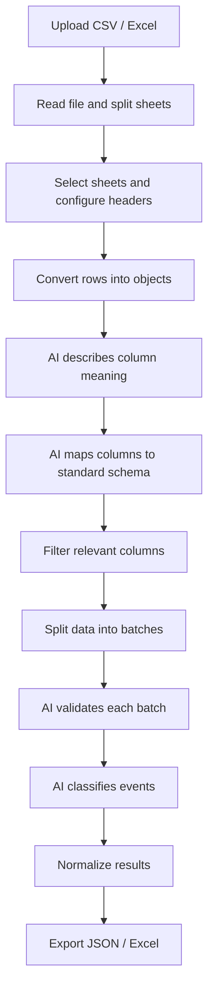

# Makana — Adaptive Data Processing Pipeline

A system I built in early 2025 to turn inconsistent Excel and CSV files into structured, normalized data without requiring a custom parser for every new format.

## The problem

Makana was processing operational data received from different companies in Excel and CSV files.

The problem was that there was no consistent schema. Column names, sheet structures, headers and formats could change from file to file, which made traditional rule-based parsing brittle.

Their CTO was spending around **8 hours per week** manually cleaning and restructuring these files.

The problem had also been used as a technical challenge for engineering candidates, but previous approaches had not been reliable enough to use in production.

I built the full solution independently in a couple of days.

## What it does

The system accepts CSV and Excel files with different structures and turns them into a common data model.

It can:

* Read files with multiple sheets
* Handle different header positions and structures
* Understand what unknown columns represent
* Map those columns into a standard schema
* Identify which information is relevant
* Validate records in batches
* Classify events such as licenses, accidents and failures
* Normalize the resulting data
* Export the final result as Excel or JSON

## How it works



## Technical approach

I deliberately combined deterministic processing with LLMs instead of asking a model to process the entire problem.

Traditional code handles the parts that should remain predictable: file ingestion, sheet parsing, row transformation, batching, validation flow and exports.

LLMs are used where the input is inherently ambiguous: understanding unfamiliar column names, mapping them into the target schema and interpreting records whose structure varies between customers.

The application was built with **Next.js and TypeScript**, with internal API routes for the AI processing pipeline and **GPT-4.1** for semantic interpretation.

I also designed the pipeline to work with relatively inexpensive models so the solution would remain economically practical in production.

## Result

The system reduced a process that required roughly **8 hours of manual work per week** from Makana's CTO to an almost immediate automated workflow.

More importantly, it continued working when the structure of incoming Excel or CSV files changed, without requiring a new parser for every customer or file format.

## Repository structure

The main application is located in [`dt_makana/`](./dt_makana).

Relevant parts of the pipeline include:

* `src/app/api/describe`
* `src/app/api/map-fields`
* `src/app/api/relevant-columns`
* `src/app/api/validate-chunk`
* `src/app/api/classify`

Sample processed outputs are available under:

`dt_makana/public/tests_results/`

## Running locally

```bash
cd dt_makana
npm install
```

Create an `.env.local` file:

```bash
OPENAI_API_KEY=your_key_here
```

Then run:

```bash
npm run dev
```

The application will be available at `http://localhost:3000`.
